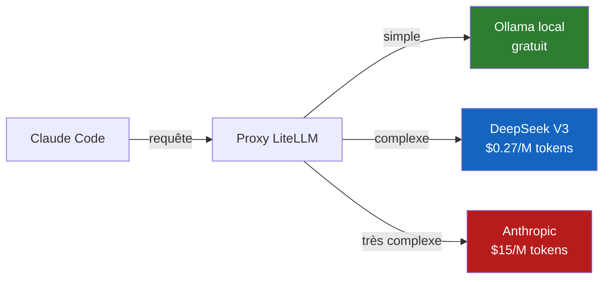
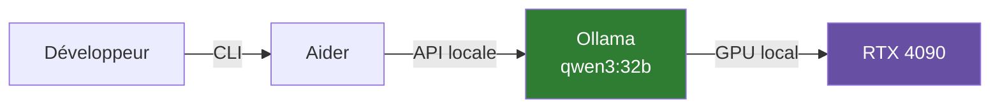

# Debloating & Proxies LLM

Les solutions de **debloating** et **proxy** permettent de réduire les coûts, d'utiliser des modèles alternatifs, et de garder le contrôle sur les requêtes LLM.

## Proxies LLM

### LiteLLM

| Caractéristique | Valeur |
|-----------------|--------|
| Repo | `github.com/BerriAI/litellm` |
| Licence | MIT |
| Stars | 15K+ |
| Fonction | Proxy unifié 100+ providers |

**Features** : Routing, rate-limiting, caching, fallbacks, cost tracking, load balancing, OpenAI-compatible API.

```yaml
# config.yaml LiteLLM
model_list:
  - model_name: claude-sonnet
    litellm_params:
      model: anthropic/claude-sonnet-4-20250514
      api_key: sk-ant-...
  - model_name: claude-sonnet
    litellm_params:
      model: ollama/qwen3:32b
      api_base: http://localhost:11434
```

### OpenRouter

| Caractéristique | Valeur |
|-----------------|--------|
| URL | `openrouter.ai` |
| Fonction | Router multi-provider, pay-per-use |

**Features** : 200+ modèles, pricing unifié, fallbacks, pas de setup serveur.

## Solutions de Debloating (Claude Code proxies)

### free-claude-code

| Caractéristique | Valeur |
|-----------------|--------|
| Repo | `github.com/llm-proxy/free-claude-code` |
| Licence | MIT |
| Stars | 35.6K+ |
| Fonction | Proxy Claude Code vers alternatives |

**Principe** : Intercepte les requêtes Claude Code et les redirige vers NVIDIA NIM, OpenRouter, DeepSeek, ou un modèle local. Permet d'utiliser Claude Code sans payer l'API Anthropic.

```bash
# Installation
pip install free-claude-code

# Rediriger vers DeepSeek
export CLAUDE_API_BASE=http://localhost:8080/v1
export CLAUDE_MODEL=deepseek-chat
```

### SEPCC (Simple External Proxy for Claude Code)

| Caractéristique | Valeur |
|-----------------|--------|
| Fonction | Proxy léger Claude Code → OpenAI-compatible |

### OpenProxy

| Caractéristique | Valeur |
|-----------------|--------|
| Fonction | Proxy open source multi-model |

### coding-proxy

| Caractéristique | Valeur |
|-----------------|--------|
| Fonction | Proxy pour coding assistants |

### CLIProxyAPI

| Caractéristique | Valeur |
|-----------------|--------|
| Fonction | API proxy pour CLI agents |

## Cas d'usage

### Réduction de coûts



### Souveraineté totale



::: callout-tip
## Stack souveraine gratuite
**Aider + Ollama + Qwen3 32B** sur une RTX 4090 = assistant de code L3, zéro télémétrie, zéro coût API. Performance ~80% de Claude Code pour du code quotidien.
:::
