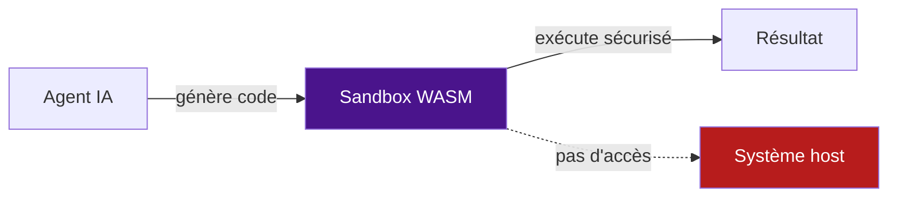

# WebAssembly (WASM) comme Sandbox

## Pourquoi WASM pour les agents ?

- **Isolation par design** — Sandbox WASM native, pas d'accès système
- **Démarrage instantané** — <1ms
- **Portabilité** — Même binaire sur toutes les plateformes
- **Sécurité** — Capability-based security (permissions explicites)
- **Léger** — Pas d'OS guest, pas de container overhead

## Runtimes WASM

| Runtime | Langages supportés | Features | Licence |
|---------|-------------------|----------|---------|
| Wasmtime | Rust, C, C++, Go, Python (via Pyodide) | WASI, Wasm Components | Apache 2.0 |
| Wasmer | Rust, C, Go, Python, JS | WASI, packages | MIT |
| WasmEdge | Rust, C, Go, JS, Python | WASI, AI extensions (GGML) | Apache 2.0 |
| Extism | Multi-language plugins | SDK Go/Rust/Python/JS | BSD-3 |

## WASI (WebAssembly System Interface)

WASI fournit une interface système sécurisée pour WASM :

| Interface | Description |
|-----------|-------------|
| `wasi_snapshot_preview1` | File I/O, clock, random, args |
| `wasi:fs` | Filesystem (sandboxed) |
| `wasi:sockets` | Network (TCP/UDP, opt-in) |
| `wasi:clocks` | Time functions |
| `wasi:random` | Random number generation |

## Python dans WASM

### Pyodide (CPython compilé en WASM)

```python
# Exécuter Python dans un sandbox WASM
from pyodide.ffi import run_python_async

result = await run_python_async("""
import numpy as np
arr = np.array([1, 2, 3, 4, 5])
print(f"Mean: {arr.mean()}")
print(f"Std: {arr.std()}")
""")
```

### WasmEdge + Python

WasmEdge supporte l'exécution de Python via WASM avec extensions AI (GGML pour LLM inference).

## Cas d'usage agents IA

### Plugin system (Extism)

```python
# Charger un plugin WASM comme tool d'agent
import extism

plugin = extism.Plugin("data_processor.wasm")
result = plugin.call("process", input_data)
```

### Sandbox d'exécution de code



## Comparaison WASM vs Container

| Critère | WASM | Docker |
|---------|------|--------|
| Démarrage | <1ms | 1-5s |
| Isolation | Sandbox native | Namespace + cgroups |
| Overhead | ~1-2MB | ~50-100MB |
| Sécurité | Capability-based | Root/namespace |
| Écosystème | En croissance | Mature |
| Language support | Grandissant | Tous |
| Network | Opt-in (WASI sockets) | Par défaut |

::: callout-tip
## WASM pour les plugins d'agents
WASM est idéal pour exécuter des **plugins/tools** d'agents IA : démarrage instantané, isolation parfaite, pas d'accès au système host. Extism facilite l'intégration multi-langage.
:::
